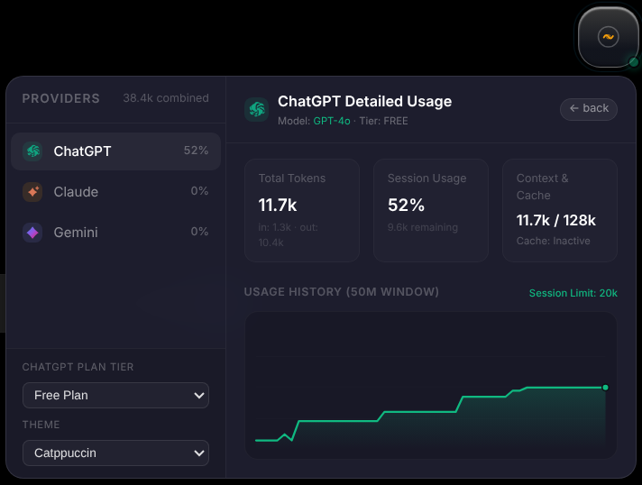
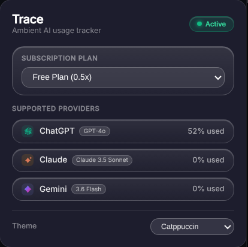
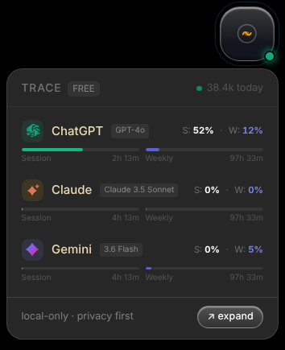

<div align="center">


# ⚡ Trace

**An ambient AI usage tracker that lives quietly in your browser.**

<p align="center">
  
</p>

<p align="center">
  
  
  
  
  
</p>

[](https://github.com/SniperRavan/trace)

</div>

---

## 📸 Preview

| Floating Ambient HUD Overlay | Expanded Analytics Dashboard |
| :--------------------------: | :--------------------------: |
|  |  |

| Toolbar Popup Control Panel | Session & Weekly Rate Limits |
| :-------------------------: | :-------------------------: |
|  |  |

---

## ✦ About

**Trace** monitors your daily token and quota consumption across core AI providers — **ChatGPT**, **Claude**, and **Gemini** — entirely locally. No cloud, no telemetry, no accounts.

The design goal is to feel like a native part of the browser — something you glance at, not something you manage. Visually inspired by **Arc Browser**, **Raycast**, and **macOS system overlays**. Aesthetically rooted in Linux terminal rice color schemes (**Catppuccin**, **Nord**, **Tokyo Night**, **Gruvbox**, **Dracula**, **Everforest**).

---

## ✨ Core Features

- **🌐 Expanded Manifest V3 Platform Support** — ChatGPT, Claude, Gemini, DeepSeek, Grok, Perplexity, and Meta AI.
- **⚡ Local Plan Auto-Detection** — Automatically detects your subscription tier (**Free**, **Pro/Plus**, **Team**, **Enterprise**) locally from page sessions and API metadata without external servers.
- **🛡️ Open-Mode Shadow DOM Isolation & Security** — Attached directly to `<body>` on provider tabs with zero CSS leakage and DOMPurify SVG sanitization.
- **📊 Dual Session & Weekly Limit Tracking** — Live tracking for both session rate limits (e.g. 5-hour window) and weekly cumulative consumption with reset countdowns.
- **⚡ Real-Time Network Interceptor & SSE Stream Counting** — MAIN world network hook intercepting fetch and XHR streams with live line-by-line streaming token ticks via `window.postMessage` (restricted origin).
- **⏱️ Context Window & Prompt Cache Timer** — Live mini context window limit bars (e.g., 200k / 128k / 1M tokens) and 5-minute prompt cache TTL expiration countdowns.
- **🧮 Per-Provider Tokenization Engine** — Tailored tokenizer calculations for OpenAI (BPE), Anthropic (Claude), Google (Gemini), and Byte-level BPE (DeepSeek).
- **💾 CSV & JSON Data Export** — One-click usage history backup and rate limit threshold alert tracking.
- **🎨 Custom SVG Sparkline Micro-Charts** — Expanded HUD analytics dashboard with SVG sparklines and theme switcher.
- **🔒 Local-Only & Privacy First** — Zero tracking, zero telemetry.

---

## 🛠️ Tech Stack

| Layer        | Technology                  | Why                                      |
|--------------|-----------------------------|------------------------------------------|
| UI           | React 19 + TypeScript 5.7   | Modern component model, strict type safety |
| Build        | Vite 6                      | Lightning fast multi-bundle builds       |
| Styling      | Tailwind CSS + CSS vars     | Utility classes + Shadow DOM tokens      |
| State        | Zustand 5                   | React 19-native lightweight state        |
| Tokenizer    | gpt-tokenizer + Per-Provider| Exact BPE & tailored provider estimators |
| Security     | DOMPurify + Origin Scope    | SAST hardened SVG & postMessage sandbox  |
| Isolation    | Shadow DOM (`open` mode)    | Zero CSS bleed between overlay and page  |

---

## 🧱 Architecture & Project Structure

```text
trace/
├── src/
│   ├── background/       # Service worker — alarms, storage relay, favicon proxy
│   ├── content/          # Content scripts — Shadow DOM injection, adapters
│   │   ├── adapters/     # Per-provider adapters (ChatGPT, Claude, Gemini, Grok, Perplexity, DeepSeek, Meta AI)
│   │   ├── interceptor.ts# MAIN world fetch/XHR/WebSocket network hook
│   │   └── providerDetect.ts # Hostname → ProviderId router
│   ├── overlay/          # Floating ambient bubble + Compact & Expanded Panels (React, Shadow DOM)
│   ├── popup/            # Extension toolbar popup dashboard (React)
│   ├── providers/        # Provider metadata + 2-layer logo system (SVG + Favicon CDN)
│   ├── storage/          # Zustand store + chrome.storage.local sync & tier presets
│   ├── tracking/         # Token estimator engine (gpt-tokenizer + fallback ratio)
│   └── components/ui/    # Shared UI components
├── public/
│   └── manifest.json     # Chrome MV3 manifest
├── references/           # Technical blueprint reference projects
└── dist/                 # Built production extension (load unpacked in Chrome)
```

---

## 🛠️ Tech Stack

| Layer        | Technology                  | Why                                      |
|--------------|-----------------------------|------------------------------------------|
| UI           | React 18 + TypeScript       | Component model, strict type safety      |
| Build        | Vite 5                      | Fast builds, multi-entry CSS inline      |
| Styling      | Tailwind CSS + CSS vars     | Utility classes + Shadow DOM tokens      |
| State        | Zustand                     | Minimal, no boilerplate                  |
| Tokenizer    | gpt-tokenizer               | Exact BPE token counting                 |
| Isolation    | Shadow DOM (`open` mode)    | Zero CSS bleed between overlay and page  |

---

## 🚀 Getting Started

### Prerequisites

- **Node.js**: ≥ 18.x (`node -v`)
- **npm**: ≥ 9.x (`npm -v`)

### Installation & Build

```bash
# 1. Clone the repository
git clone https://github.com/SniperRavan/trace.git
cd trace

# 2. Install dependencies
npm install

# 3. Run type checking & unit tests
npm run type-check
npm test

# 4. Build production extension assets
npm run build
```

### 🧩 How to Load & Use Trace in Your Browser (Developer Mode)

Since Trace is currently loaded locally as a developer build, follow these step-by-step instructions to load it into your browser:

#### 🌐 For Chrome & Chromium Browsers (Brave, Edge, Arc, Opera, Vivaldi, Zen)

1. **Build the extension package**:
   Make sure you have compiled the latest build:
   ```bash
   npm run build
   ```
   This generates the production bundle inside the `dist/` directory.

2. **Open Extensions Management**:
   - Open your browser and navigate to `chrome://extensions` (or `edge://extensions` in Microsoft Edge, `brave://extensions` in Brave).
   - Alternatively, click the **Extensions Menu** (puzzle piece icon 🧩) in your toolbar and select **Manage Extensions**.

3. **Enable Developer Mode**:
   - Locate the **Developer mode** toggle switch in the top-right corner of the Extensions page and turn it **ON** 🟢.

4. **Load the `dist` Folder**:
   - Click the **Load unpacked** button that appears in the top-left toolbar.
   - In the file picker dialog, navigate to the `trace` project folder and select the **`dist`** directory (e.g. `/path/to/trace/dist`).
   - Click **Select Folder** (or **Open**).

5. **Verify Installation**:
   - You should now see **Trace ⚡** listed under your installed extensions.
   - Click the extension puzzle icon 🧩 in your browser toolbar and pin **Trace** for quick access.

6. **Start Tracking**:
   - Open any supported AI provider tab:
     - 🟢 **ChatGPT**: [chatgpt.com](https://chatgpt.com)
     - 🟠 **Claude**: [claude.ai](https://claude.ai)
     - 🟣 **Gemini**: [gemini.google.com](https://gemini.google.com)
   - The ambient HUD overlay will automatically appear in the bottom corner of the web page, quiet and isolated!

---

#### 🦊 For Mozilla Firefox

1. **Build for Firefox**:
   ```bash
   npm run build:firefox
   ```
2. Open `about:debugging#/runtime/this-firefox` in Firefox.
3. Click **Load Temporary Add-on...**
4. Select `manifest.json` inside the generated `dist/` directory.

---

## 📚 Inspirations & References

Trace builds upon technical blueprints, rate-limiting insights, and tokenization techniques pioneered by open-source projects. Special thanks and credit to:

1. **[Claude Usage Tracker Extension](https://github.com/lugia19/Claude-Usage-Extension)** (`references/Claude-Usage-Extension` by lugia19):
   - Provided blueprints for native Claude organization endpoint querying (`/api/organizations/{orgId}/usage`), rate limit watching (`message_limit`, HTTP 429 status handling), and prompt caching TTL lifetime mechanics.
2. **[Claude Counter](https://github.com/she-llac/claude-counter)** (`references/claude-counter`):
   - Inspired live SSE `message_limit` utilization fraction parsing, 200k context limit visualization, and isolated world message bridging (`window.postMessage` bridge model).
3. **[gpt-tokenizer](https://github.com/niieani/gpt-tokenizer)** (`references/gpt-tokenizer` by niieani):
   - Provided the high-performance BPE tokenizer engine (`cl100k_base` and `o200k_base`) for exact token calculations.

---

## 📬 Contact & Credits

<a href="https://github.com/sniperravan">
  
</a>

<div align="center">
  <sub>Built with 💚 by <a href="https://github.com/sniperravan">SniperRavan</a> — An ambient, local-first AI usage companion.</sub>
</div>


